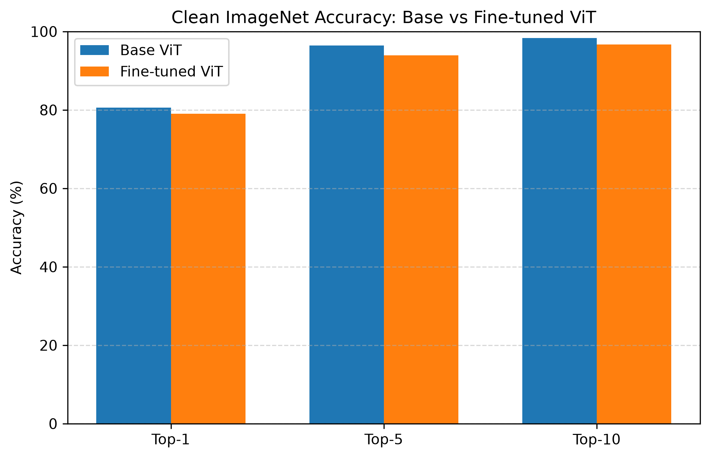
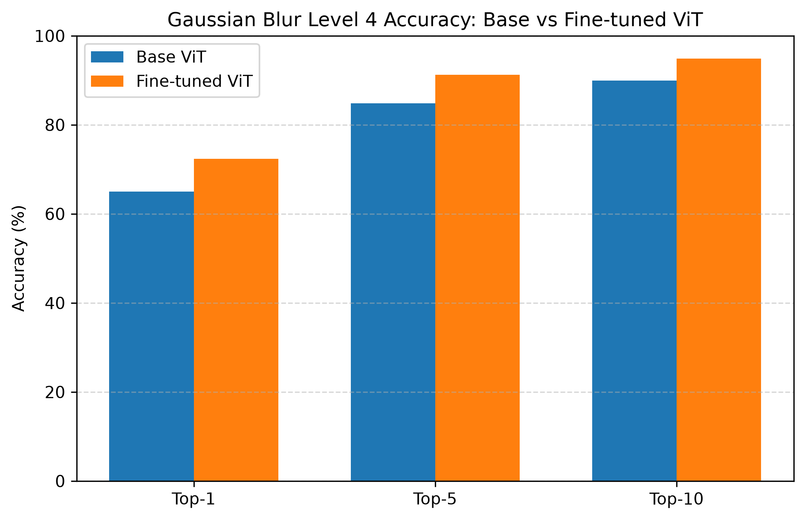
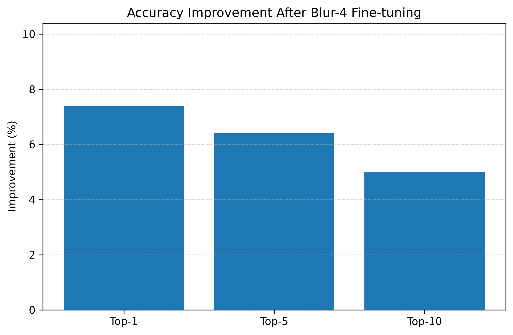
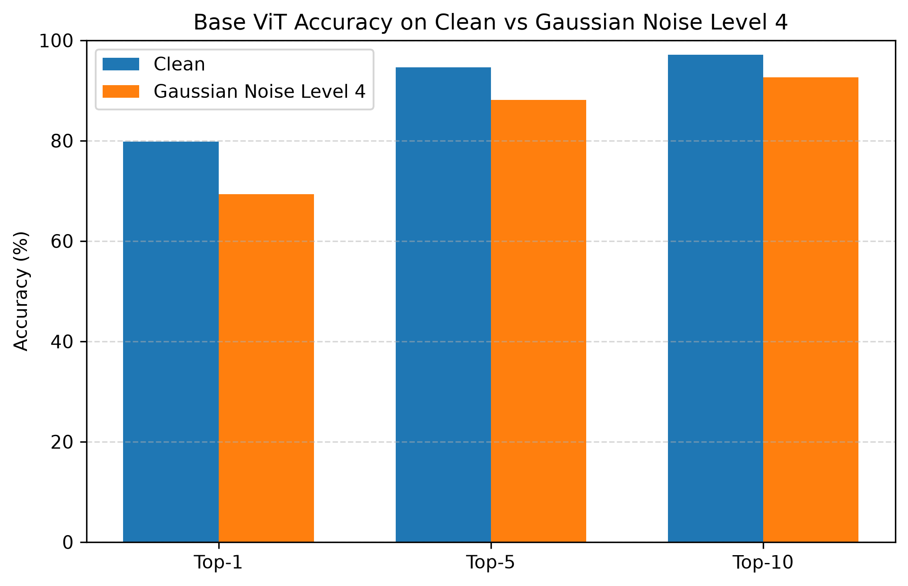
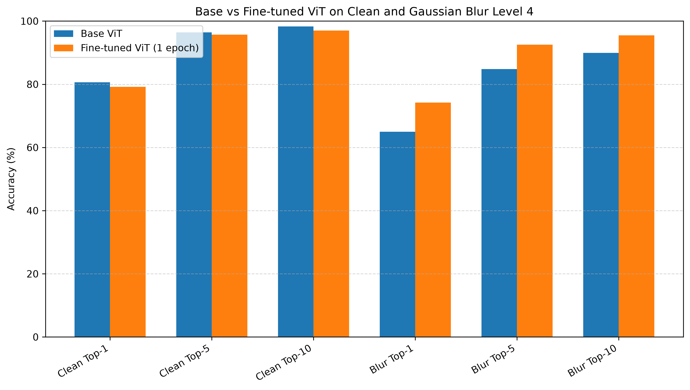

# Progress Report: Mechanistic Analysis of Adversarial Fine-tuning of Vision Transformers

## 1. Project Objective

This project is a simplified reproduction and extension of the paper *"A Mechanistic Analysis of Adversarial Fine-tuning of Vision Transformers"*. The goal is to study how adversarial or corruption-specific fine-tuning changes the robustness of Vision Transformer models.

The original paper fine-tuned multiple Vision Transformer models on Gaussian Blur and Gaussian Noise corruptions. In the current reproduction, the main focus is Gaussian Blur level 4. This allows us to first reproduce the central blur robustness result in a controlled setting before extending the analysis to other corruption types and mechanistic interpretability methods.

## 2. Model Used

- Model: `google/vit-base-patch16-224`
- Architecture: Vision Transformer Base with patch size 16
- Task: ImageNet 1000-class image classification

The model is a pretrained Vision Transformer that takes images of size 224 x 224 and predicts one of the 1000 ImageNet classes.

## 3. Dataset

The dataset used in this project is the ImageNet ILSVRC2012 validation set. The full validation set contains 50,000 images. For this reproduction, selected subsets of the validation set were used for training, validation, and final testing.

The data split is:

| Image Range | Purpose |
|---|---|
| Images 1-10,000 | Blur-4 fine-tuning |
| Images 10,001-11,000 | Validation during training and early stopping |
| Images 11,001-12,000 | Final unseen test set |

This split ensures that the model is evaluated on images that were not used during fine-tuning or validation.

## 4. Corruptions Added

Two corruption types were added to the project.

### A. Gaussian Blur Level 4

Gaussian Blur level 4 is the main corruption used for fine-tuning. It is applied at runtime inside the Dataset class. The original ImageNet images are not permanently changed.

### B. Gaussian Noise Level 4

Gaussian Noise level 4 was added as an extra evaluation corruption. It is used to test whether robustness learned from blur fine-tuning transfers to noise corruption. Like blur, Gaussian Noise is also applied at runtime.

## 5. Runtime Corruption Explanation

The project does not save a separate blurred or noisy copy of the whole dataset. Instead, each image is opened from the original ImageNet files, corrupted in memory, converted to a tensor, and passed to the model.

This means that the original ImageNet files remain unchanged. The corruption is temporary and exists only during data loading and evaluation.

## 6. Evaluation Metrics

The project implements the same classification metrics used in the paper:

- Top-1 Accuracy: the prediction is counted as correct if the model's highest-scoring class is the true class.
- Top-5 Accuracy: the prediction is counted as correct if the true class appears in the model's five highest-scoring classes.
- Top-10 Accuracy: the prediction is counted as correct if the true class appears in the model's ten highest-scoring classes.

Top-5 and Top-10 accuracy are useful because ImageNet contains many visually similar classes, so the correct label may appear near the top even when it is not ranked first.

## 7. Base Model Results

| Dataset | Top-1 | Top-5 | Top-10 |
|---|---:|---:|---:|
| Clean | 80.6% | 96.4% | 98.3% |
| Gaussian Blur Level 4 | 65.0% | 84.8% | 89.9% |

The base model performs well on clean ImageNet images. However, its accuracy drops significantly under Gaussian Blur level 4. This shows that the pretrained ViT is sensitive to blur corruption and provides a clear motivation for corruption-specific fine-tuning.

## 8. Fine-tuning Setup

The model was fine-tuned on Gaussian Blur level 4 using the following setup:

- Training samples: 10,000
- Optimizer: AdamW
- Learning rate: `5e-5`
- Scheduler: Linear learning-rate scheduler
- Maximum epochs: 10
- Early stopping: enabled
- Best checkpoint: `checkpoints/vit_blur4_best`

Early stopping stopped training after 4 epochs because validation Top-1 accuracy stopped improving. The best validation Blur Top-1 accuracy was 74.0%.

## 9. Final Fine-tuned Model Results

| Dataset | Top-1 | Top-5 | Top-10 |
|---|---:|---:|---:|
| Clean | 79.0% | 93.9% | 96.7% |
| Gaussian Blur Level 4 | 72.4% | 91.2% | 94.9% |

Fine-tuning improved robustness to Gaussian Blur level 4 while causing only a small drop in clean accuracy. This result supports the main idea that targeted fine-tuning can improve performance under a specific corruption.

## 10. Base vs Fine-tuned Comparison

| Metric | Base ViT | Blur-4 Fine-tuned ViT | Change |
|---|---:|---:|---:|
| Clean Top-1 | 80.6% | 79.0% | -1.6% |
| Clean Top-5 | 96.4% | 93.9% | -2.5% |
| Clean Top-10 | 98.3% | 96.7% | -1.6% |
| Blur Top-1 | 65.0% | 72.4% | +7.4% |
| Blur Top-5 | 84.8% | 91.2% | +6.4% |
| Blur Top-10 | 89.9% | 94.9% | +5.0% |

The largest improvement is in Blur Top-1 accuracy, which increased by 7.4 percentage points. Blur Top-5 and Top-10 accuracy also improved clearly. Clean accuracy decreased slightly, which suggests a small trade-off between clean performance and blur robustness.

## 11. Comparison with Base Paper

The paper reported the following results for the Blur-4 tuned model:

- Top-1: 75.3%
- Top-5: 92.9%
- Top-10: 95.4%

Our Blur-4 fine-tuned model achieved:

- Top-1: 72.4%
- Top-5: 91.2%
- Top-10: 94.9%

The reproduction results are close to the paper, especially for Top-5 and Top-10 accuracy. The Top-1 result is lower than the paper by 2.9 percentage points, but the overall trend matches the paper: fine-tuning on Blur-4 improves blur robustness substantially while preserving most clean-image performance.

## 12. Noise-4 Evaluation

| Model | Clean Top-1 | Noise-4 Top-1 | Noise-4 Top-5 | Noise-4 Top-10 |
|---|---:|---:|---:|---:|
| Base ViT | 79.8% | 69.3% | 88.1% | 92.6% |
| Blur-4 Fine-tuned ViT | 79.0% | 65.6% | 87.1% | 91.5% |

The Blur-4 fine-tuned model improved on blur but did not improve on noise. In fact, Noise-4 Top-1 accuracy dropped from 69.3% to 65.6%. This suggests that robustness learned from Gaussian Blur does not transfer well to Gaussian Noise.

This is an important result because blur and noise are both image corruptions, but they affect images in different ways. Blur removes high-frequency detail, while noise adds random high-frequency variation. The model appears to learn features that help with blur but do not help with noise.

## 13. Graphs

The following graphs are available and embedded below.

## 14. Key Findings

- Gaussian Blur level 4 significantly reduces base ViT performance.
- Fine-tuning on Blur-4 improves blur robustness.
- Clean accuracy drops only slightly after fine-tuning.
- Blur robustness does not transfer to Noise-4.
- The reproduction results are close to the base paper.

## 15. Next Steps

The next stage of the project will move from performance reproduction toward mechanistic analysis. Planned next steps include:

- Add the Expected Calibration Error (ECE) calibration metric.
- Start Logit Lens analysis.
- Perform attention entropy analysis.
- Perform representation similarity analysis.
- Optionally train a Noise-4 fine-tuned model later.
- Optionally test adversarial attacks such as FGSM and PGD later.

These steps will help explain how fine-tuning changes the internal behavior of the Vision Transformer, not only its final classification accuracy.
